# 📚 My Book Shelf App (Created By: Talha Shafique)
Premium Digital Library & Book Management App

  

## 📦 Description My Book Shelf App
My Book Shelf App is a modern, elegant, and user-friendly digital library application designed for book lovers who want to organize and manage their personal book collections efficiently. Built using Flutter & Dart, the app delivers a smooth and visually appealing experience where users can track books, categorize reading progress, and maintain a beautifully organized virtual bookshelf. The app focuses on simplicity, productivity, and premium UI/UX design, allowing users to explore their collection effortlessly with fluid navigation and clean layouts. Users can add books, manage reading statuses, save favorites, and access detailed book information in one centralized platform. My Book Shelf App transforms traditional book management into a smart and immersive digital experience.

## ⚙️ Technologies Used
- 💻 **Language:** Flutter (Dart)
- 🎨 **UI Framework:** Material 3 + Custom Library Theme
- 🧩 **Architecture:** Clean Architecture / Provider
- 📚 **Features:** Digital Bookshelf, Reading Tracker, Favorites System, Category Management, Smooth Animations
  
## ✨ Core Features
- 📖 **Personal Digital Library:** Organize and manage your entire book collection
- 🗂️ **Category Browsing:** Explore books by genres, authors, and custom categories
- 📑 **Reading Status Tracking:** Mark books as To-Read, Reading, or Finished
- ❤️ **Favorites System:** Save and quickly access your favorite books
- 🔍 **Book Details Preview:** View complete information about each book
- ⚡ **Fast & Lightweight:** Optimized for smooth and responsive performance
- 🎭 **Premium UI/UX:** Elegant interface with clean layouts and fluid transitions
- 📱 **Smart Library Management:** Easily track and maintain your reading journey

## 📱 App Screenshots

| **1. App Banner** | **2. Splash Screen** | **3. Onboarding Screen** | **4. Onboarding Screen** | **5. Login Screen** | **6. Sign Up Screen** | **7. Forgot Screen** |
| :---: | :---: |:---: | :---: | :---: | :---: | :---: | 
|  | 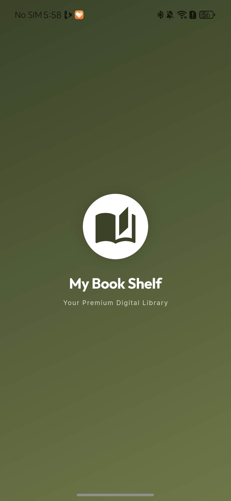 | 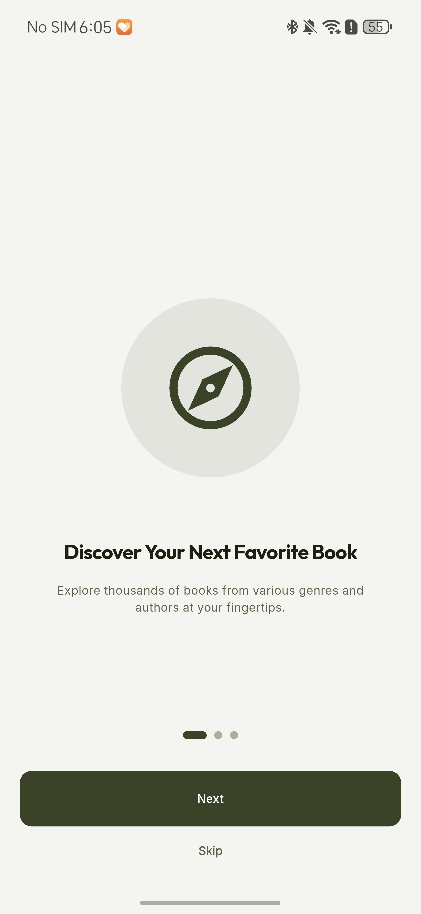 | 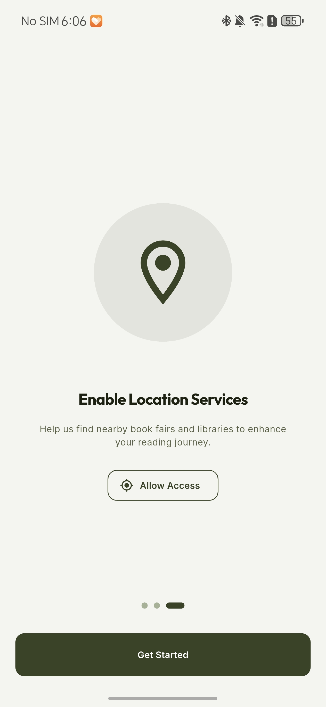 | 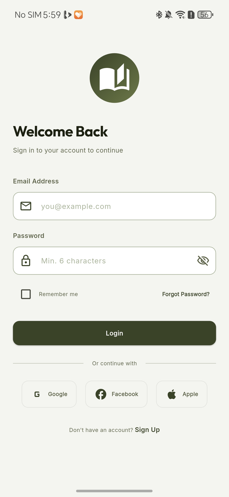 | 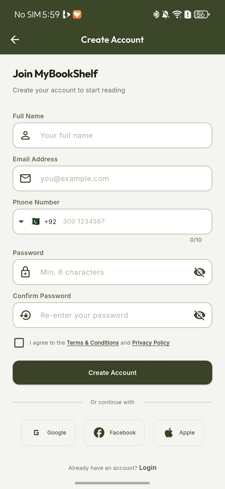 | 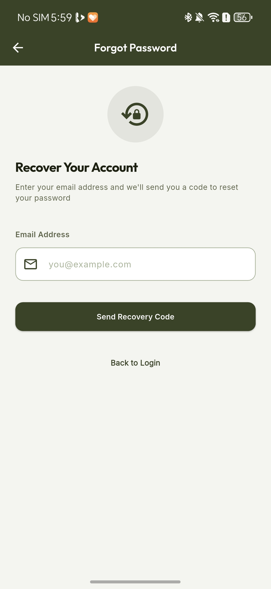 |
| **8. Home Dashboard Screen** | **9. Drawer Menu Screen** | **10. Language Dialouge Screen** | **11. Book Details Screen** | **12. Book Downloading Screen** | **13. Book Read Preview Screen** | **14. Book Favorites Screen** |
| 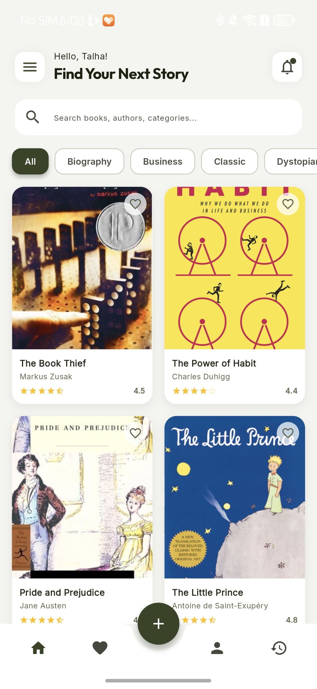 | 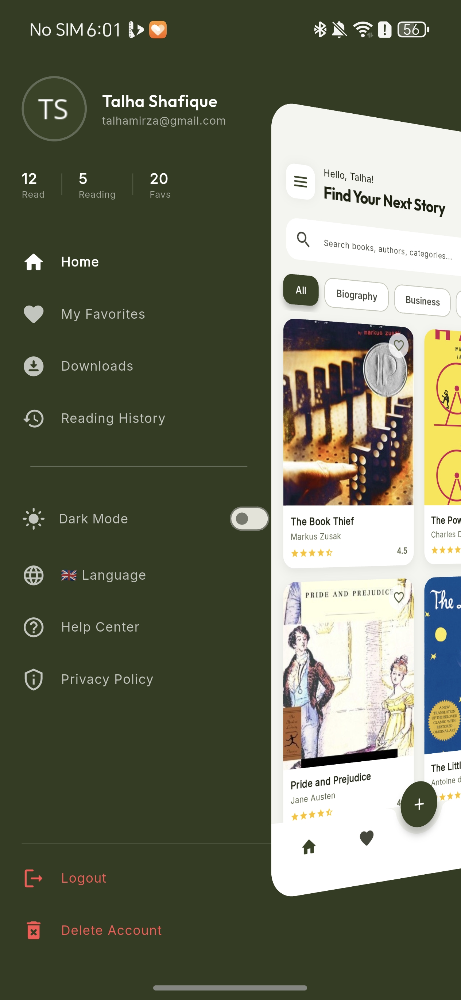 | 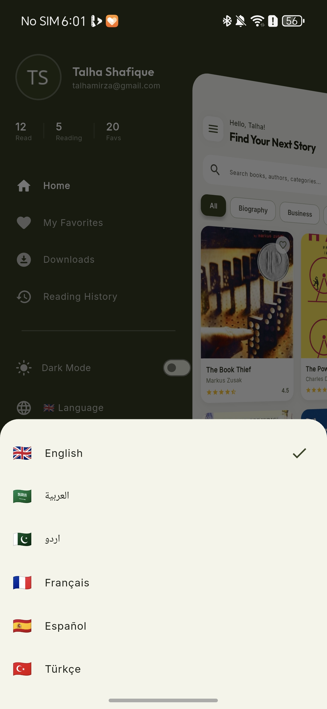 | 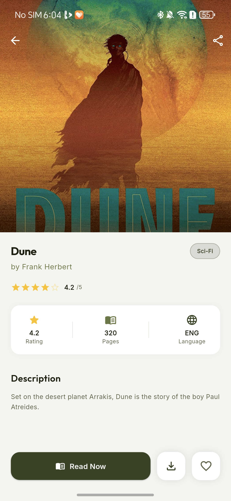 | 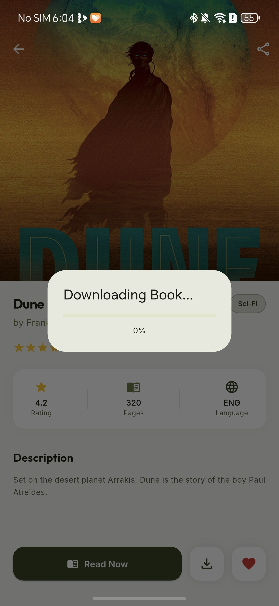 | 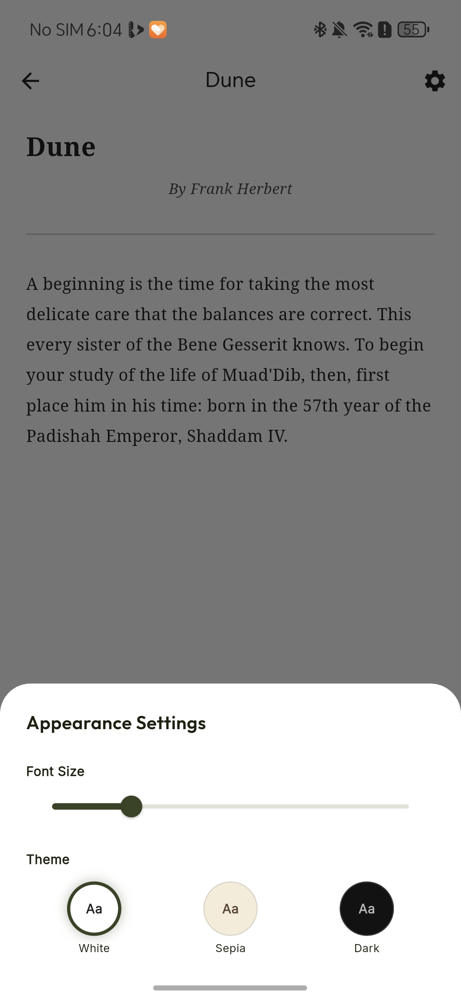 | 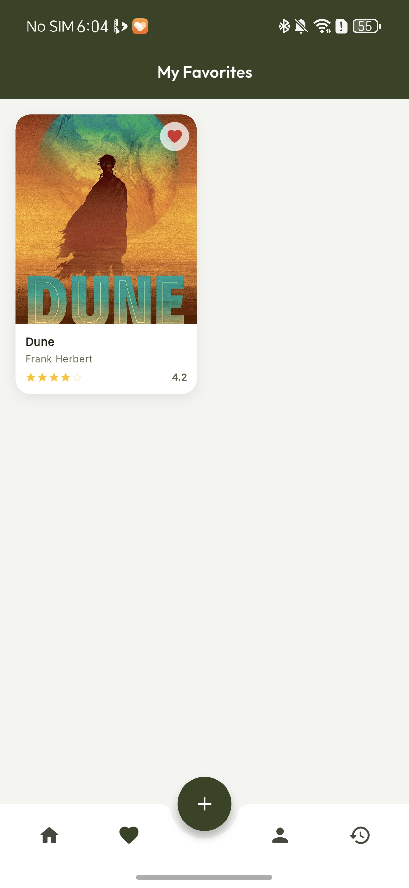 |
| **15. Book Reading History Screen** | **16. Notification Screen** | **17. Account Details Screen** | **18. Change Password Screen** | **19. Setting Screen** | **20. Biometric Registration Screen** | **21. Logout Dialouge Screen** |
| 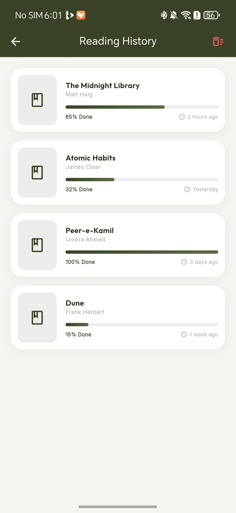 | 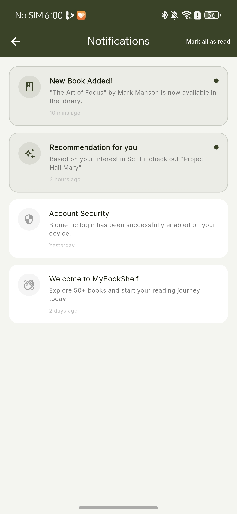 | 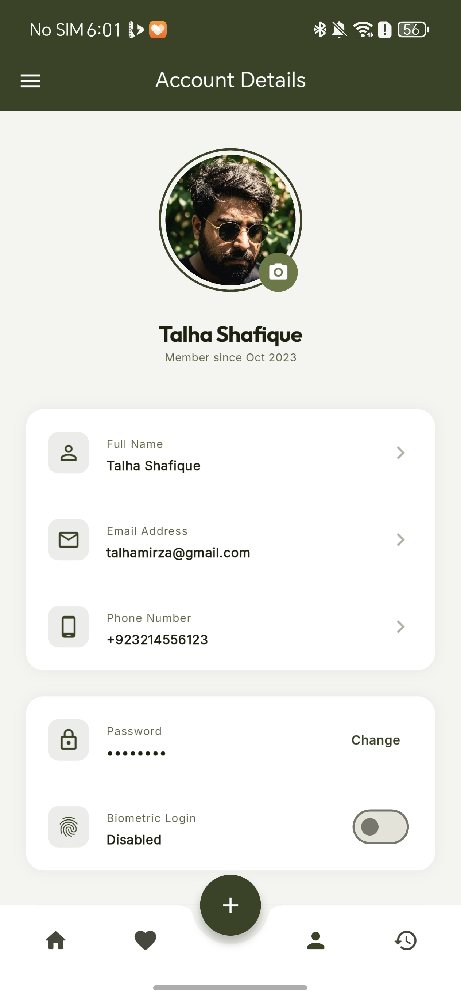 | 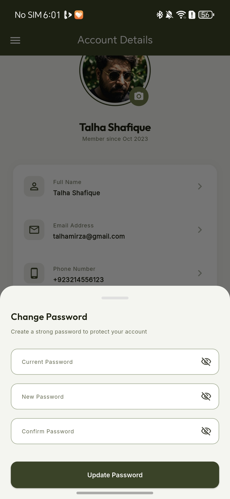 | 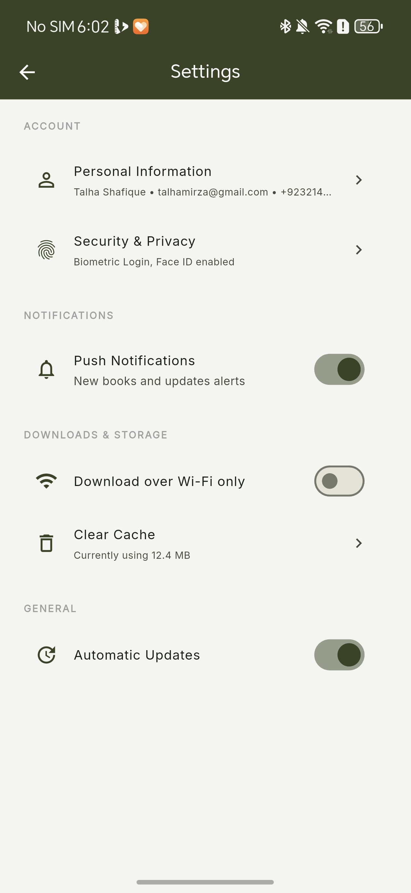 | 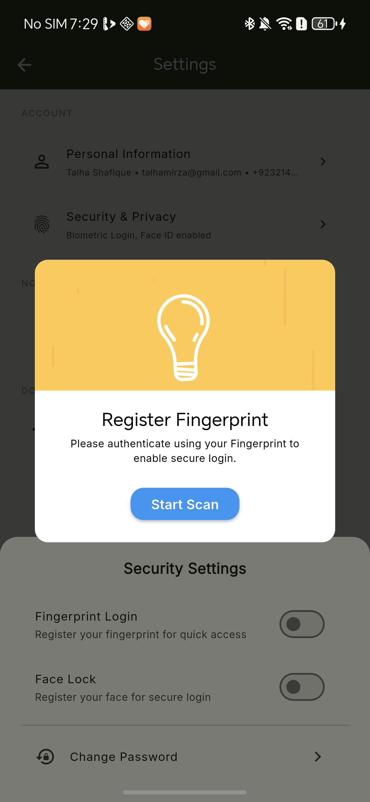 | 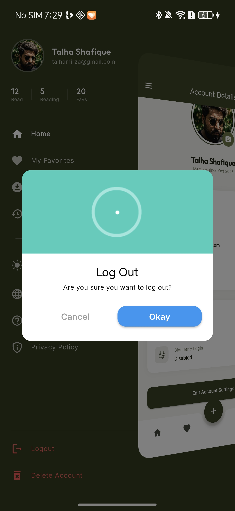 |
